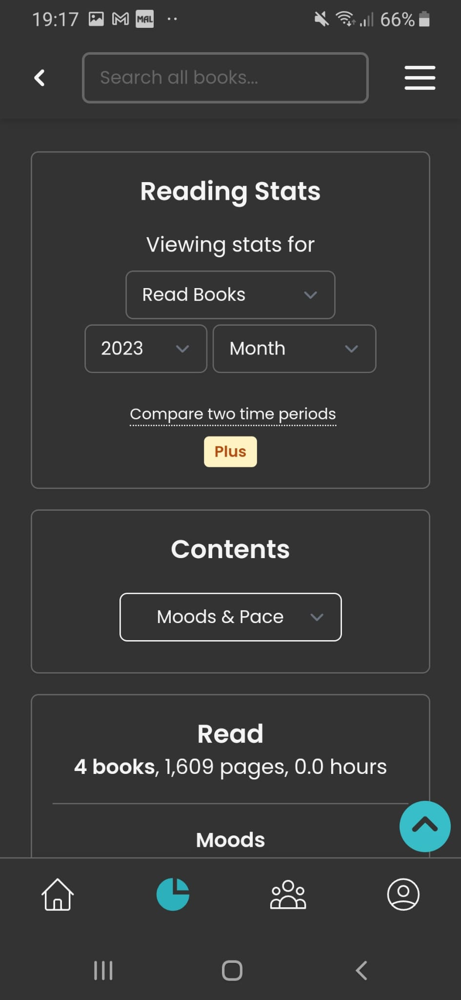
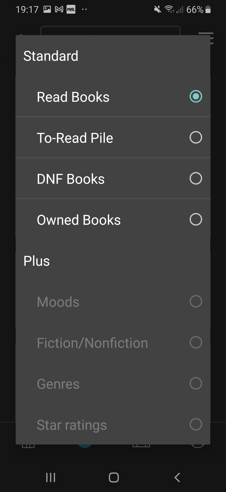
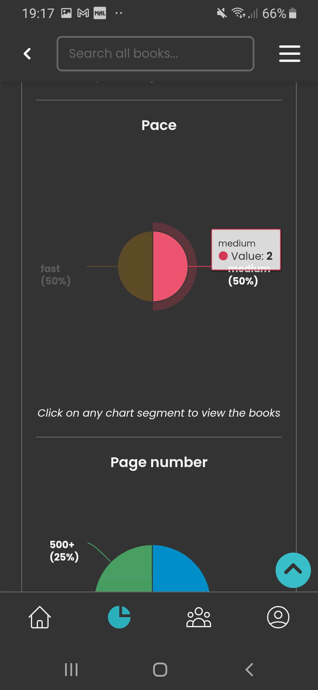
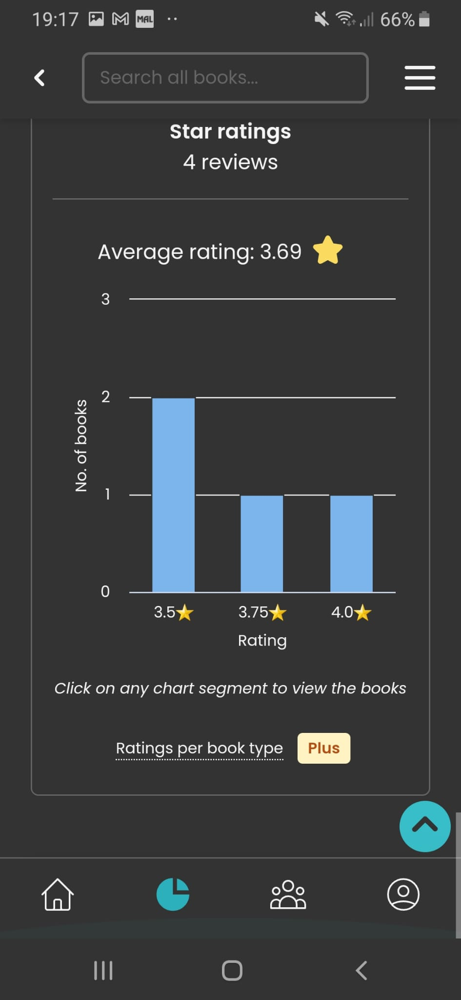
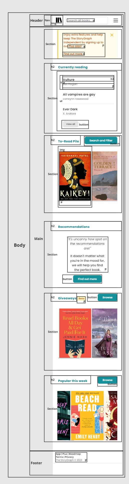

# Procesverslag
Markdown is een simpele manier om HTML te schrijven.  
Markdown cheat cheet: [Hulp bij het schrijven van Markdown](https://github.com/adam-p/markdown-here/wiki/Markdown-Cheatsheet).

Nb. De standaardstructuur en de spartaanse opmaak van de README.md zijn helemaal prima. Het gaat om de inhoud van je procesverslag. Besteedt de tijd voor pracht en praal aan je website.

Nb. Door *open* toe te voegen aan een *details* element kun je deze standaard open zetten. Fijn om dat steeds voor de relevante stuk(ken) te doen.

## Jij

  
uitwerken voor kick-off werkgroep

  ### Auteur:
  Diya Leda

  #### Je startniveau:
  Blauw

  #### Je focus:
  Surface plane
 

## Je website

  
uitwerken voor kick-off werkgroep

  ### Je opdracht:
  De website/app 	<a href="https://app.thestorygraph.com"> The Storygraph</a> is een applicatie waar jij je boeken in kan opslaan. Je kan duidelijk sorteren met welke boeken je al gelezen hebt en welke je nog moet lezen. Je kan ook gemakkelijk zien welke schrijver(st)er of genre je leuk vind, omdat er verschillende grafieken zijn die dat weergeven.

  #### Screenshot(s) van de eerste pagina (small screen): 
  
Home-pagina

  
  
  
  

  #### Screenshot(s) van de tweede pagina (small screen):
  
Statenstieken-scherm. Hier kan je verschillende grafieken zien over het aantal boeken of welke genre je het meeste gelezen heb. 

  
  
  
  
  

 

## Toegankelijkheidstest 1/2 (week 1)

  
uitwerken na test in 2e werkgroep

  ### Bevindingen
  
Lijst met je bevindingen die in de test naar voren kwamen:

  
-Het eerste wat is zag was dat een groot stuk van de CSS in de HTML stond. 

  
-Ook werden er h2 en h3 door elkaar gebruikt, terwijl dat bij tags hetzelfde gestijld werden. Kan je liever één h2 gebruiken voor alle kopjes.

  
-Voor mijn gevoel bleek het ook dat ze onnodige div's hadden gebruikt.

  

## Breakdownschets (week 1)

  
uitwerken na afloop 3e werkgroep

  ### de hele pagina's: 
  Home-pagina:
    

  Stats:

  ### dynamisch deel (bijv menu): 
  

  ### wellicht nog een dynamisch deel (bijv filter): 
  

## Voortgang 1 (week 2)

  
uitwerken voor 1e voortgang

  
  In deze week was ik ziek, dus kon ik jammer genoeg niet bij de eerste voortgangsgesprek zijn. U kunt bij mijn groepsgenoten; Kaylin Noëlla, Insa en Sem zien wat er deze week besproken werd.

## Voortgang 2 (week 3)

  
uitwerken voor 2e voortgang

  ### Stand van zaken
  hier dit ging goed & dit was lastig (neem ook screenshots op van delen van je website en code)

  ### Agenda voor meeting
  samen met je groepje opstellen

  | Kaylin Noëlla                  | Insa               | Sem                        | Diya(ik)         |
  | ---                            | ---                | ---                        | ---              |
  | CSS optimaliseren en sematiek  | en dit             | Hero, hamburger en images  | Filters toevoegen|
  | en dat ook nog                 | dit als er tijd is | nog een punt               | dit wil ik zeker |
  | ...                            | ...                | ...                        | ...              |

  ### Verslag van meeting
  hier na afloop snel de uitkomsten van de meeting vastleggen

  - punt 1
  - punt 2
  - nog een punt
- ...

## Toegankelijkheidstest 2/2 (week 4)

  
uitwerken na test in 9e werkgroep

  ### Bevindingen
  Lijst met je bevindingen die in de test naar voren kwamen (geef ook aan wat er verbeterd is):

## Voortgang 3 (week 4)

  
uitwerken voor 3e voortgang

  ### Stand van zaken
  hier dit ging goed & dit was lastig (neem ook screenshots op van delen van je website en code)

  ### Agenda voor meeting
  samen met je groepje opstellen

  | student 1      | student 2          | student 3    | student 4        |
  | ---            | ---                | ---          | ---              |
  | dit bespreken  | en dit             | en ik dit    | en dan ik dat    |
  | en dat ook nog | dit als er tijd is | nog een punt | dit wil ik zeker |
  | ...            | ...                | ...          | ...              |

  ### Verslag van meeting
  hier na afloop snel de uitkomsten van de meeting vastleggen

  - punt 1
  - punt 2
  - nog een punt
  - ...

## Eindgesprek (week 5)

  
uitwerken voor eindgesprek

  ### Je uitkomst - karakteristiek screenshots:
  

  ### Dit ging goed/Heb ik geleerd: 
  Korte omschrijving met plaatjes

  

  ### Dit was lastig/Is niet gelukt:
  Korte omschrijving met plaatjes

  

## Bronnenlijst

  
continu bijhouden terwijl je werkt

  Nb. Wees specifiek ('css-tricks' als bron is bijv. niet specifiek genoeg). 
  Nb. ChatGpT en andere AI horen er ook bij.
  Nb. Vermeld de bronnen ook in je code.

  1. bron 1
  2. bron 2
  3. ...

