# Procesverslag
Markdown is een simpele manier om HTML te schrijven.  
Markdown cheat cheet: [Hulp bij het schrijven van Markdown](https://github.com/adam-p/markdown-here/wiki/Markdown-Cheatsheet).

Nb. De standaardstructuur en de spartaanse opmaak van de README.md zijn helemaal prima. Het gaat om de inhoud van je procesverslag. Besteedt de tijd voor pracht en praal aan je website.

Nb. Door *open* toe te voegen aan een *details* element kun je deze standaard open zetten. Fijn om dat steeds voor de relevante stuk(ken) te doen.

## Jij

  
uitwerken voor kick-off werkgroep

  ### Auteur:
  Diya Leda

  #### Je startniveau:
  Blauw

  #### Je focus:
  Surface plane
 

## Je website

  
uitwerken voor kick-off werkgroep

  ### Je opdracht:
  De website/app 	<a href="https://app.thestorygraph.com"> The Storygraph</a> is een applicatie waar jij je boeken in kan opslaan. Je kan duidelijk sorteren met welke boeken je al gelezen hebt en welke je nog moet lezen. Als je op één van de boekenkaft afbeeldingen klikt kom je op een informatie pagina.

  #### Screenshot(s) van de eerste pagina (small screen): 
  <h2>Home-pagina</h2>
  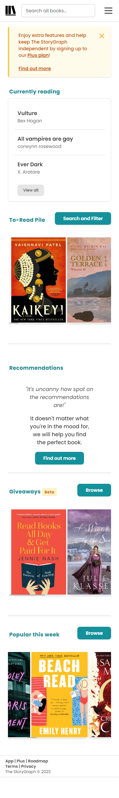
  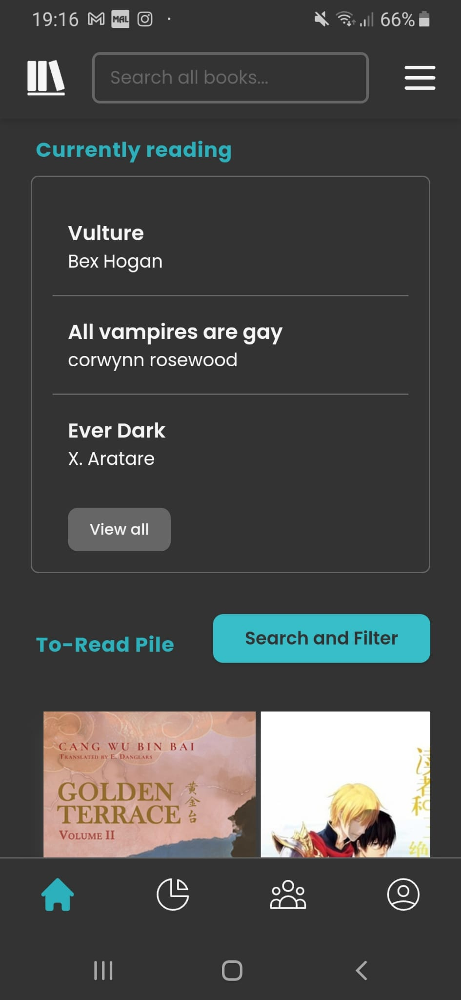
  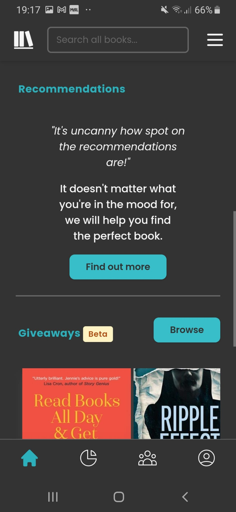
  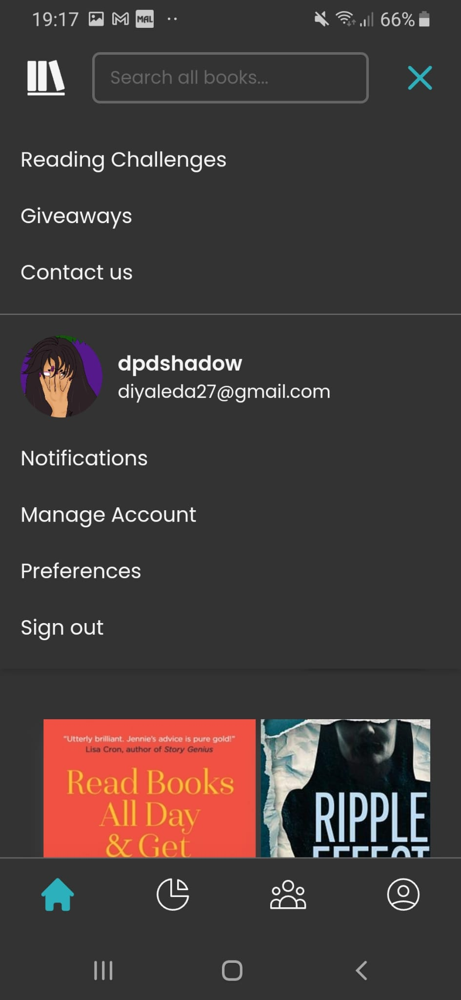

  #### Screenshot(s) van de tweede pagina (small screen):
  <h2>Informatie-scherm. </h2>
  
Op deze pagina kan je informatie over één boek lezen en je kan hierdoor je keuze maken of je het boek wel wilt lezen. 

  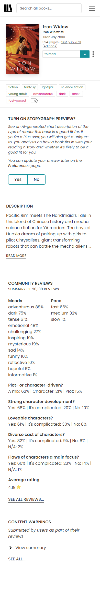
  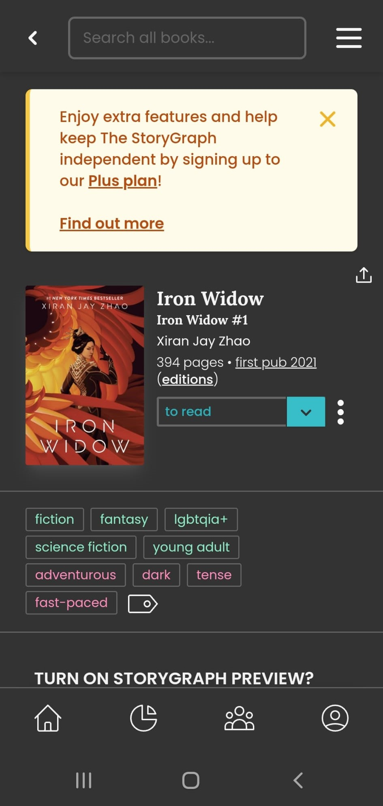
  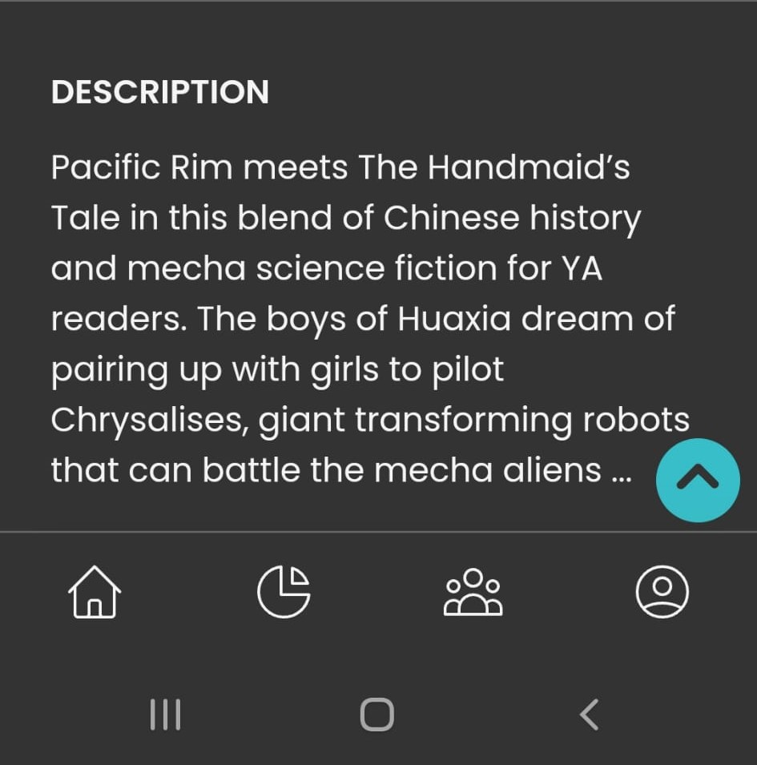
  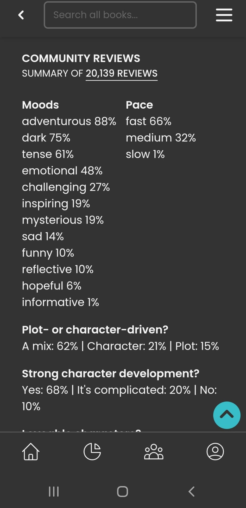
  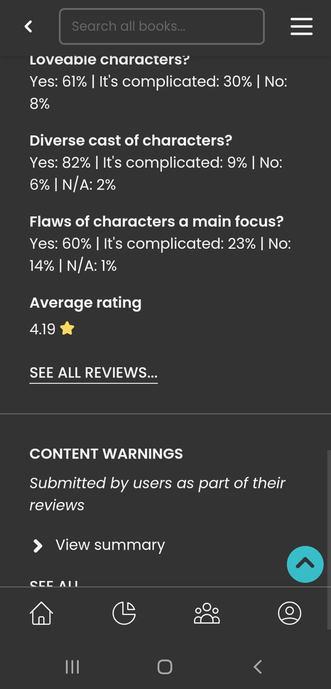

 

## Toegankelijkheidstest 1/2 (week 1)

  
uitwerken na test in 2e werkgroep

  ### Bevindingen
  
Lijst met je bevindingen die in de test naar voren kwamen:

  
-Het eerste wat is zag was dat een groot stuk van de CSS in de HTML stond, in de head. 

  
-Ook werden er h2 en h3 door elkaar gebruikt, terwijl dat bij tags hetzelfde gestijld werden. Kan je liever één h2 gebruiken voor alle kopjes.

  
-Voor mijn gevoel bleek het ook dat ze onnodige div's hadden gebruikt.

  
Er word geen gebruik gemaakt van een header, main en footer.

  
-Foto's maken wel gebruik van een alt, maar die is niet altijd correct of duidelijk

  <h2>Screenreader</h2>
  
-Als je met de screenreader in de body komt, zit hij vast op onzichtbare woorden.

  

## Breakdownschets (week 1)

  
uitwerken na afloop 3e werkgroep

  ### de hele pagina's: 
  <h2>Home-pagina:</h2>
    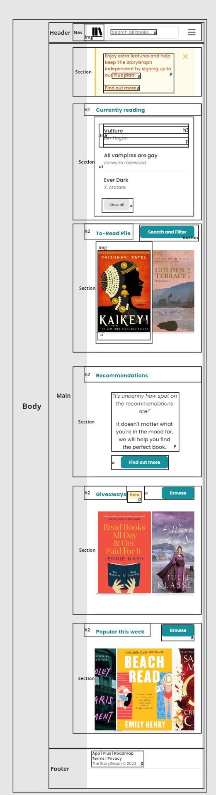

  <h2>Stats:</h2>
    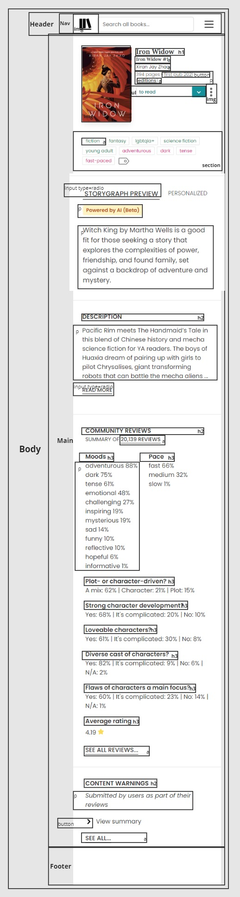
    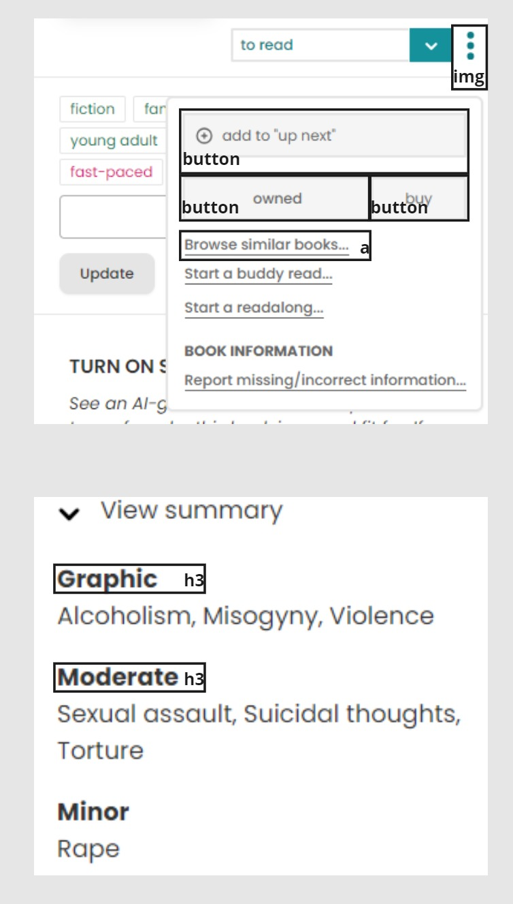

  ### dynamisch deel (bijv menu): 
  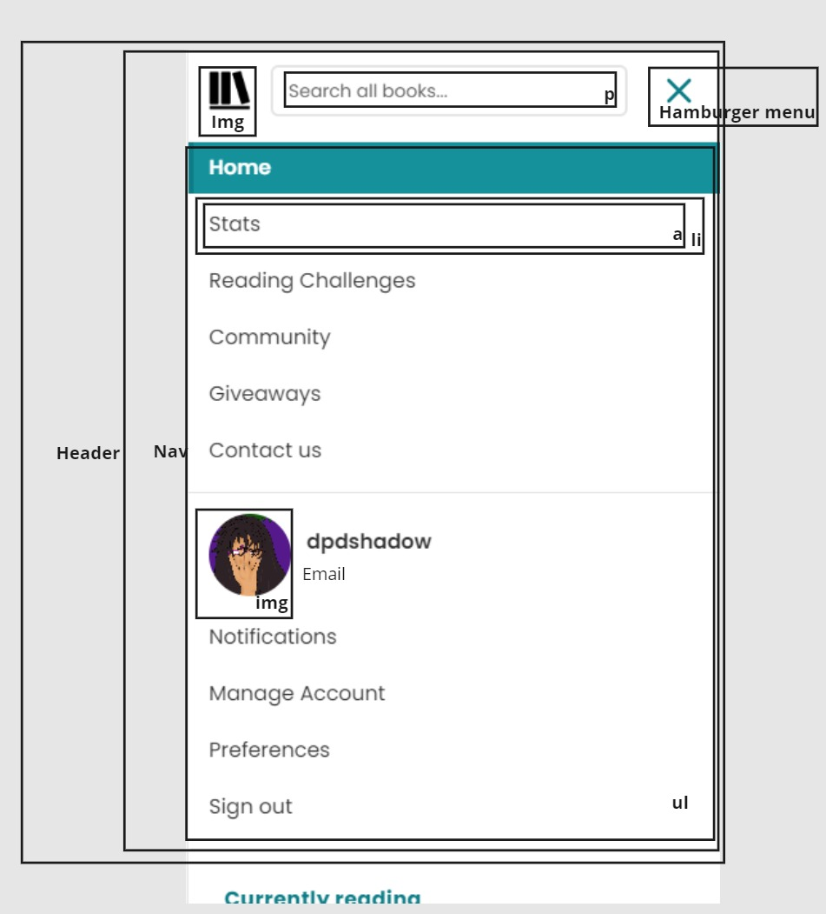

  ### wellicht nog een dynamisch deel (bijv filter): 

## Voortgang 1 (week 2)

  In deze week was ik ziek, dus kon ik jammer genoeg niet bij de eerste voortgangsgesprek zijn. U kunt bij mijn groepsgenoten; Kaylin Noëlla, Insa en Sem zien wat er deze week besproken werd.

## Voortgang 2 (week 3)

  
uitwerken voor 2e voortgang

  ### Stand van zaken
  
Voor deze week heb ik alleen kunnen werken aan de basis HTML en CSS. 

   
In de eerste twee afbeeldingen kun je de pagina's van de homepagina zien. Ik heb mijn h2's als in sections opgedeelt. Ik heb voor nu ook op beide pagina's een h1 gezet, maar ik moet nog kijken op welke grote ik ze wil hebben. En ook of ik het daar wil hebben.

   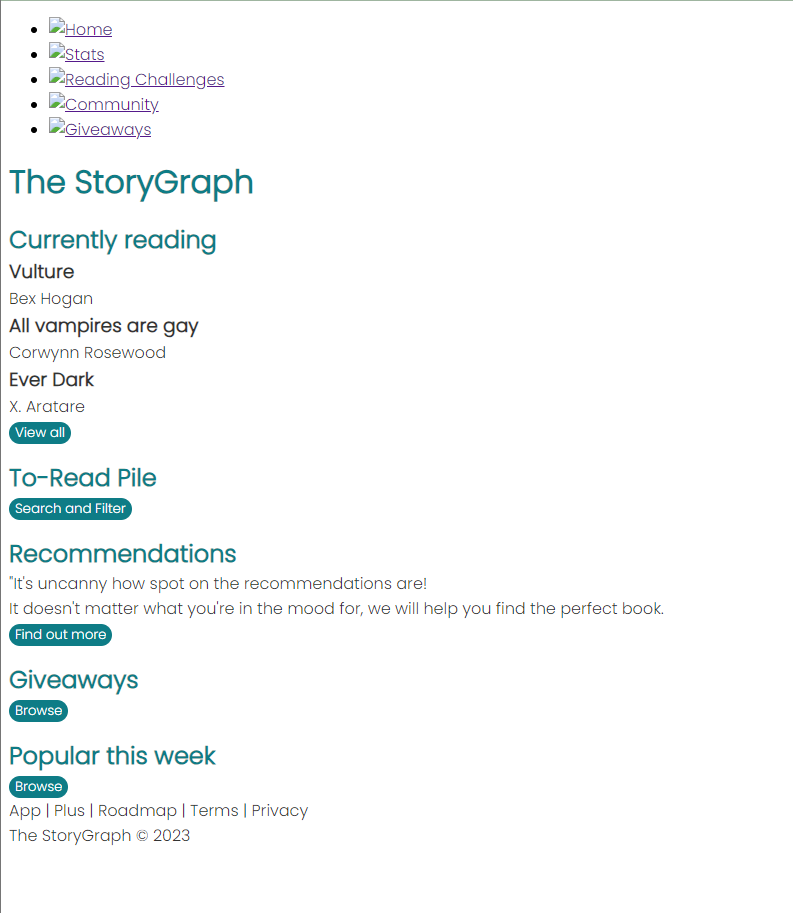
  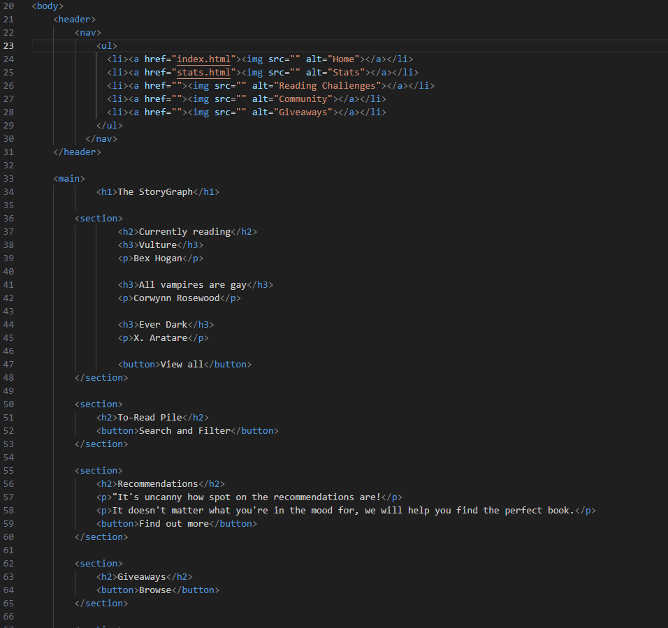 

  
Bij de deze pagina heb ik hetzelfde gedaan, alleen heb ik voor deze pagina in de apparte CSS iets om de sections gezet. Die vakken zijn van de orginele website.

  
  
 

  ### Agenda voor meeting
  samen met je groepje opstellen

  | Kaylin Noëlla     | Insa   | Sem    | Diya(ik)         |
  | ---               | ---    | ---    | ---              |              
  | CSS optimaliseren | (Ziek) | (Ziek) | Filters toevoegen|                  
  | sematiek          |        |        | SVG animatie     |
  | ...               | ...    | ..     | ...              |

  ### Verslag van meeting
  hier na afloop snel de uitkomsten van de meeting vastleggen
  - Ik moet even kijken of de svg animatie wel gaat lukken, het is moeilijk. Voor de filter moet ik Sanne vragen of zelf onderzoeken uitvoeren.
  - ./ voor linken, img. Kan ook custom properties maken voor margin, meer dan kleur.
  - Gebruik comments in de css en html.
  - Buttons veranderen naar a href=#. Buttons zijn voor formulieren.

## Toegankelijkheidstest 2/2 (week 4)

  
uitwerken na test in 9e werkgroep

  ### Bevindingen
  Lijst met je bevindingen die in de test naar voren kwamen (geef ook aan wat er verbeterd is):

## Voortgang 3 (week 4)

  
uitwerken voor 3e voortgang

  ### Stand van zaken
  hier dit ging goed & dit was lastig (neem ook screenshots op van delen van je website en code)

  ### Agenda voor meeting
  samen met je groepje opstellen

  | student 1      | student 2          | student 3    | student 4        |
  | ---            | ---                | ---          | ---              |
  | dit bespreken  | en dit             | en ik dit    | en dan ik dat    |
  | en dat ook nog | dit als er tijd is | nog een punt | dit wil ik zeker |
  | ...            | ...                | ...          | ...              |

  ### Verslag van meeting
  hier na afloop snel de uitkomsten van de meeting vastleggen

  - punt 1
  - punt 2
  - nog een punt
  - ...

## Eindgesprek (week 5)

  
uitwerken voor eindgesprek

  ### Je uitkomst - karakteristiek screenshots:
  

  ### Dit ging goed/Heb ik geleerd: 
  Korte omschrijving met plaatjes

  

  ### Dit was lastig/Is niet gelukt:
  Korte omschrijving met plaatjes

  

## Bronnenlijst

  
continu bijhouden terwijl je werkt

  Nb. Wees specifiek ('css-tricks' als bron is bijv. niet specifiek genoeg). 
  Nb. ChatGpT en andere AI horen er ook bij.
  Nb. Vermeld de bronnen ook in je code.

  1. bron 1
  2. bron 2
  3. ...

